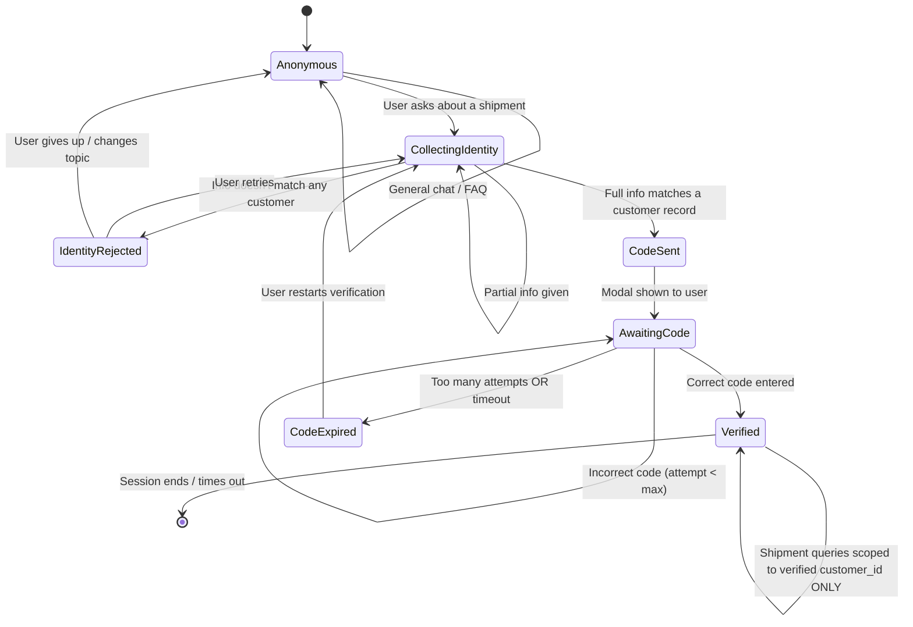

# 6.2 Conversation / identity-gating state machine

Source: `docs/SecureShip-5Week-Program.md`, section 6.2 (line 430). Copied verbatim as the starting reference.

```mermaid
stateDiagram-v2
    [*] --> Anonymous

    Anonymous --> Anonymous: General chat / FAQ
    Anonymous --> CollectingIdentity: User asks about a shipment

    CollectingIdentity --> CollectingIdentity: Partial info given
    CollectingIdentity --> IdentityRejected: Info doesn't match any customer
    CollectingIdentity --> CodeSent: Full info matches a customer record

    IdentityRejected --> CollectingIdentity: User retries
    IdentityRejected --> Anonymous: User gives up / changes topic

    CodeSent --> AwaitingCode: Modal shown to user
    AwaitingCode --> Verified: Correct code entered
    AwaitingCode --> AwaitingCode: Incorrect code (attempt < max)
    AwaitingCode --> CodeExpired: Too many attempts OR timeout

    CodeExpired --> CollectingIdentity: User restarts verification

    Verified --> Verified: Shipment queries scoped to verified customer_id ONLY
    Verified --> [*]: Session ends / times out
```
