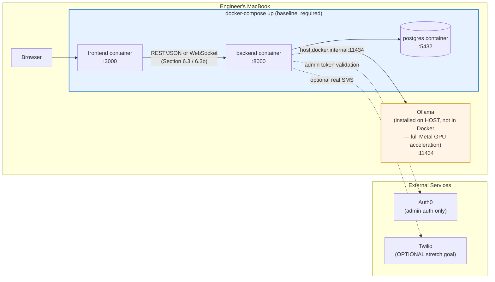

# 6.5 Deployment / local dev topology

Source: `docs/SecureShip-5Week-Program.md`, section 6.5 (line 669). Copied verbatim as the starting reference.

```mermaid
flowchart LR
    subgraph DevMachine["Engineer's MacBook"]
        direction TB

        subgraph Compose["docker-compose up (baseline, required)"]
            direction TB
            ReactC["frontend container<br/>:3000"]
            PyC["backend container<br/>:8000"]
            PgC[("postgres container<br/>:5432")]
        end

        Browser[Browser]
        OllamaHost["Ollama<br/>(installed on HOST, not in Docker<br/>— full Metal GPU acceleration)<br/>:11434"]
    end

    subgraph Cloud["External Services"]
        AuthProvider["Auth0<br/>(admin auth only)"]
        TwilioOpt["Twilio<br/>(OPTIONAL stretch goal)"]
    end

    Browser --> ReactC
    ReactC -->|"REST/JSON or WebSocket<br/>(Section 6.3 / 6.3b)"| PyC
    PyC -->|"host.docker.internal:11434"| OllamaHost
    PyC --> PgC
    PyC -.->|"admin token validation"| AuthProvider
    PyC -.->|"optional real SMS"| TwilioOpt

    style Compose fill:#e6f2ff,stroke:#3380cc,stroke-width:2px
    style OllamaHost fill:#fff4e6,stroke:#cc8800,stroke-width:2px
```
