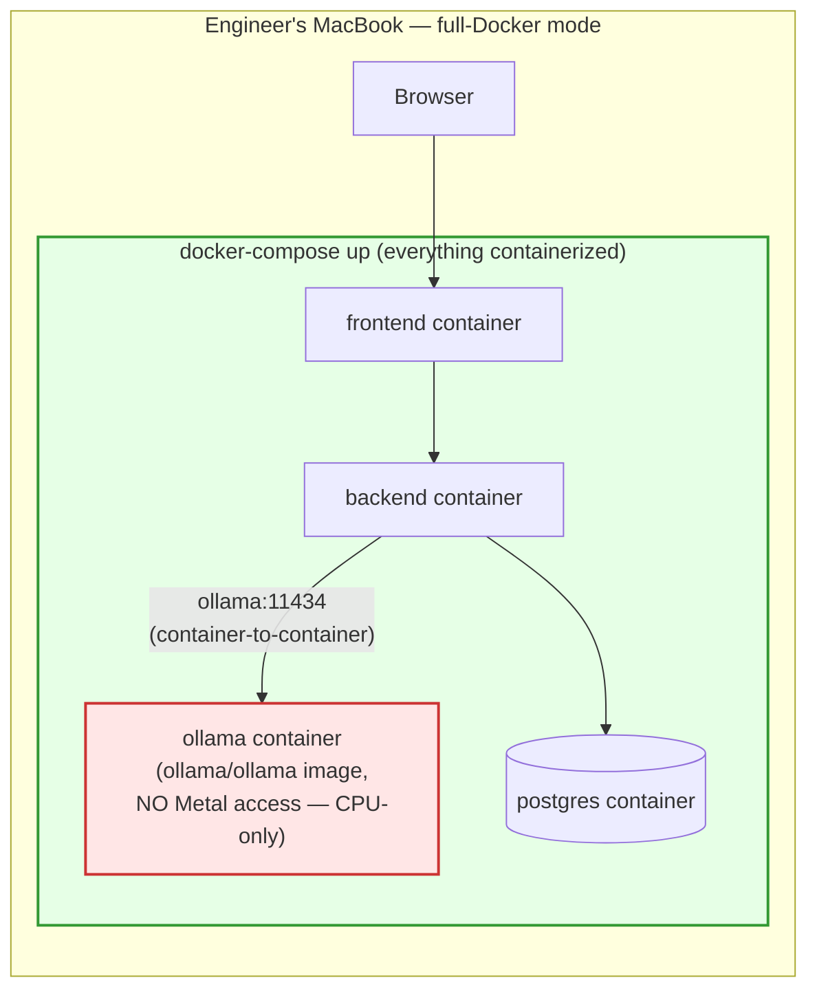

# 6.5 Deployment / local dev topology — Bonus tier (Ollama containerized)

Source: `docs/SecureShip-5Week-Program.md`, section 6.5 (line 703). Copied verbatim as the starting reference.

```mermaid
flowchart LR
    subgraph DevMachine["Engineer's MacBook — full-Docker mode"]
        direction TB
        subgraph Compose["docker-compose up (everything containerized)"]
            direction TB
            ReactC2["frontend container"]
            PyC2["backend container"]
            PgC2[("postgres container")]
            OllamaC["ollama container<br/>(ollama/ollama image,<br/>NO Metal access — CPU-only)"]
        end
        Browser2[Browser]
    end

    Browser2 --> ReactC2
    ReactC2 --> PyC2
    PyC2 -->|"ollama:11434<br/>(container-to-container)"| OllamaC
    PyC2 --> PgC2

    style Compose fill:#e6ffe6,stroke:#339933,stroke-width:2px
    style OllamaC fill:#ffe6e6,stroke:#cc3333,stroke-width:2px
```
